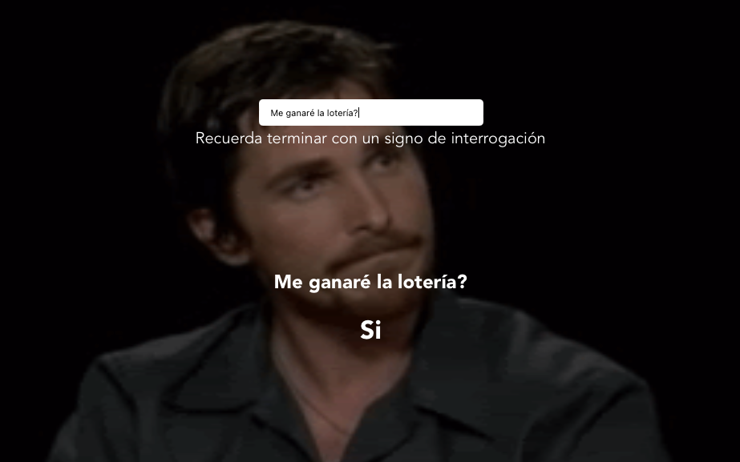

<p align="center">
    <a href="https://www.twitter.com/alexcamachogz">
        
    </a>
</p>

<h1 id="indecision">
  
  Vue app: Indecision
</h1>

Indecision is my first app created in Vue 3. I developed this app in a Vue course.
You can ask your yes or no question to the app, and it will answer you using [yesno API](https://yesno.wtf).

## Table of contents

- [Indecision](#indecision)
- [Available Scripts](#scrips)
- [Preview](#preview)
- [Technologies](#technologies)
- [Author](#author)

<hr/>

<h2 id="scripts">
  
  Available Scripts
</h2>

#### Project setup

```
yarn install
```

#### Compiles and hot-reloads for development

```
yarn serve
```

#### Compiles and minifies for production

```
yarn build
```

#### Run your unit tests

```
yarn test:unit
```

#### Lints and fixes files

```
yarn lint
```

<h2 id="preview">
  
  Preview
</h2>



<h2 id="technologies">
  
  Technologies
</h2>

1. HTML
2. CSS
3. JavaScript
4. Vue 3
5. ESLint with Standard.js
6. Jest

<h2 id="author">
  
  Author
</h2>

**Alejandra Camacho** - [@alexcamachogz](https://github.com/alexcamachogz)

> This project was developed in 
> [Fernando Herrera](https://fernando-herrera.com/)'s
> [Vue.js: De cero a experto](https://www.udemy.com/course/vuejs-fh/) course.
